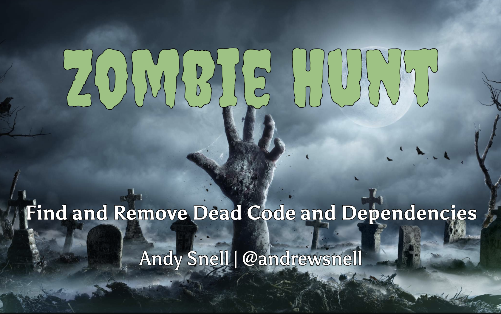

# Zombie Hunt: Find and Safely Remove Undead Code

Dead and outdated code is a stumbling block to upgrading, refactoring, and maintaining any software project, and at
worse could become a security vulnerability. As a rule, we want to remove code and dependencies that just don’t belong
in the code base anymore; however, it’s not always clear if and when dead code is really dead. Removing “zombie” code
can be disastrous if it is still being used in production. We’ll cover common ways to statically identify dead code, and
the accompanying pitfalls. We’ll then cover creating and using code tombstones in our project to definitively identify
the living dead. Finally, we’ll discuss some best practices to avoid having zombies in your code in the first place!

## Latest Slides

**Slide Deck Link:** [https://wkdb.yt/zombie-slides](https://wkdb.yt/zombie-slides)

## Resources

### Tombstone Background

* ["Night of the Living Dead (Code)", Chris Tankersley](https://www.phparch.com/article/education-station-night-of-the-living-dead-code/) (
  Paywall)
* ["Isn't That Code Dead?", David Schnepper, Velocity Santa Clara 2014](https://www.youtube.com/watch?v=29UXzfQWOhQ)
* [PHP: debug_backtrace](https://www.php.net/manual/en/function.debug-backtrace.php)

### Tombstone Packages

* [wickedbyte/tombstone](https://github.com/wickedbyte/tombstone)
* [scheb/tombstone](https://github.com/scheb/tombstone)
* [tombstone-analyzer](https://github.com/scheb/tombstone-analyzer)

### Other Dead Code Detection Tools
* [composer/unused/composer-unused](https://github.com/composer-unused/composer-unused)
* [shipmonk/composer-dependency-analyser](https://github.com/shipmonk-rnd/composer-dependency-analyser)

* [krakjoe/tombs](https://github.com/krakjoe/tombs)
* [SolidWorx/Burial](https://github.com/SolidWorx/Burial)
* [Insolita/unused-scanner](https://github.com/Insolita/unused-scanner)

### Other Resources

* [Dependabot (GitHub)](https://dependabot.com)